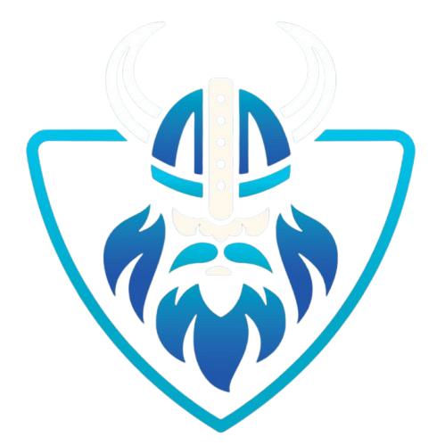

<div align="center">

# 🎓 Odin Labs



[](https://flutter.dev)
[](https://firebase.google.com)
[](https://developers.google.com/ml-kit)

### Empowering IT Education Through Innovation

*A comprehensive e-learning platform for aspiring IT professionals*

[View Demo](link) · [Report Bug](link) · [Request Feature](link)

</div>

---

## 📱 System Architecture

Odin Labs consists of two main components:

1. **Mobile Application**: The primary learning platform for students
2. **Admin Panel**: A web-based dashboard for course management and content delivery

<div align="center">
<!---->
</div>

## ✨ Key Features

### Mobile Application

<table>
<tr>
<td>

#### 🔐 Authentication
- Google Sign-in
- GitHub Integration
- Email/Password Registration

</td>
<td>

#### 📚 Learning
- 14 IT Categories
- Free & Premium Courses
- Progress Tracking

</td>
<td>

#### 🤖 Smart Features
- AI Chatbot 'Bitzy'
- Text Recognition
- Image Enhancement

</td>
</tr>
</table>

### Admin Panel

<table>
<tr>
<td>

#### 📊 Dashboard
- Analytics Overview
- User Management
- Revenue Tracking

</td>
<td>

#### 📝 Content Management
- Course Creation
- Resource Upload
- Category Management

</td>
<td>

#### 💼 Business Tools
- Payment Processing
- User Support
- Performance Metrics

</td>
</tr>
</table>

## 🎯 Course Categories

<div align="center">

| Category | Description |
|----------|------------|
| 💻 Software Development | Core programming and software engineering |
| 🌐 Web Development | Frontend and backend web technologies |
| 📱 Mobile Development | iOS, Android, and cross-platform development |
| 📊 Data Science | Data analysis and visualization |
| 🤖 AI & Machine Learning | Artificial intelligence and ML algorithms |
| ☁️ Cloud Computing | Cloud platforms and services |
| 🔒 Cybersecurity | Security protocols and threat prevention |
| 🔄 DevOps | Development operations and automation |
| 🎮 Game Development | 2D/3D game design and development |
| 🔗 Blockchain & Web3 | Distributed ledger technologies |
| 🎨 UI/UX Design | User interface and experience design |
| 🤖 Robotics and IoT | Connected devices and automation |
| 🎯 Graphic Design | Digital art and visual communication |
| ✅ Software Testing & QA | Quality assurance and testing methodologies |

</div>

## 🛠️ Technical Implementation

### Mobile App Dependencies

```yaml
dependencies:
  # Firebase Services
  firebase_core: ^3.10.1
  firebase_auth: ^5.4.1
  cloud_firestore: ^5.6.2
  firebase_storage: ^12.4.2
  
  # UI Components
  flutter_svg: ^2.0.17
  lottie: ^3.3.1
  animate_do: ^3.3.4
  
  # Media & ML
  google_mlkit_text_recognition: ^0.14.0
  camera: ^0.11.1
  video_player: ^2.9.2
  
  # State Management & Utils
  provider: ^6.1.2
  shared_preferences: ^2.4.0
```

## 🚀 Getting Started

### Prerequisites

- Flutter SDK (latest version)
- Firebase Account
- IDE (Android Studio/VS Code)
- Git

### Installation Process

1. **Clone the Repository**
   ```bash
   git clone https://github.com/VichithChamodya/Odin-Lab.git
   cd Odin-Lab
   ```

2. **Install Dependencies**
   ```bash
   flutter pub get
   ```

3. **Firebase Configuration**
   > ⚠️ **Important Note**: Firebase configuration files are not included in the repository for security reasons.
   
   To obtain the necessary configuration files:
   - Contact me at:
     - 📧 Email: vichithwikramarathna@gmail.com
     - 💼 LinkedIn: www.linkedin.com/in/vichith-wickramarathna
   - Provide your:
     - GitHub username
     - Intended use case
     - Organization details (if applicable)

4. **Launch the Application**
   ```bash
   flutter run
   ```

## 💫 App Navigation

<div align="center">
<!---->
</div>

The application features five main sections:

- **🔍 Explore**: Discover courses and learning paths
- **🔖 Bookmarks**: Save and access favorite content
- **🛠️ Tools**: Access ML-powered features
- **📚 My Courses**: Track learning progress
- **👤 Profile**: Manage account settings

## 🔒 Security & Privacy

- End-to-end encryption for user data
- Secure payment processing
- Regular security audits
- GDPR compliance
- Data backup and recovery protocols

## 🤝 Contributing

We welcome contributions! Please follow these steps:

1. Fork the repository
2. Create your feature branch (`git checkout -b feature/AmazingFeature`)
3. Commit changes (`git commit -m 'Add AmazingFeature'`)
4. Push to branch (`git push origin feature/AmazingFeature`)
5. Open a Pull Request

## 📄 License

This project is licensed under the MIT License - see the [LICENSE](LICENSE) file for details.

## 🙏 Acknowledgments

- Flutter Development Team
- Firebase Platform
- Google ML Kit
- All Contributors

---

<div align="center">

### Made with ❤️ by VichithChamodya

[](https://github.com/VichithChamodya)

</div>
